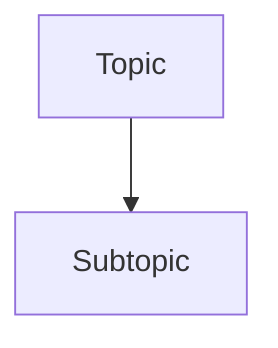

# Advanced & Obsidian-Specific Formatting Guide

This guide covers Obsidian-specific syntax and advanced Markdown features required for the Observer system. Standard Markdown is omitted for efficiency.

**Note:** If this guide is insufficient for a complex formatting task, use the links in the [References](#-references) section to perform a targeted web search or documentation lookup.

## 1. Internal Links & Transclusion (Embeds)

Internal links are the foundation of the Obsidian knowledge graph.

### Linking to Notes
Use double brackets: `[[Note Name]]`

### Aliases
Change display text: `[[Note Name|Display Text]]`

### Linking to Headers
Link to a specific section: `[[Note Name#Header Name]]`

### Linking to Blocks
Link to a specific paragraph/item: `[[Note Name#^block-id]]` (See Section 3 for defining IDs).

### Transclusion (Embedding)
Add `!` to display the content of the linked note, header, or block inline:
- `![[Note Name]]` (Embed entire note)
- `![[Note Name#Header]]` (Embed section)
- `![[Note Name#^block-id]]` (Embed specific block)

### Embedding Images, PDFs & Media
Add `!` to embed the file:
- `![[Image.png|200]]` (Image with width)
- `![[Document.pdf]]` (Embed PDF)
- `![[Document.pdf#page=3]]` (Embed specific PDF page)
- `![[Audio.mp3]]` (Embedded audio player)
- `![[Video.mp4]]` (Embedded video player)

## 2. Callouts & Highlights

### Callouts
Use callouts to highlight important information. Supported types include `[!info]`, `[!note]`, `[!tip]`, `[!warning]`, `[!danger]`, `[!bug]`, etc.

> [!info]
> This is a callout block.

### Highlights
Use double equals to highlight text:
`==Highlighted text==`

## 3. Block Identifiers

You can link to specific blocks (paragraphs, list items, etc.) by adding a block identifier at the end of the block.

This is a paragraph with an ID. ^my-block-id

### Linking to Blocks
`[[Note Name#^my-block-id]]`

## 4. Advanced Tables

Basic tables use `|` and `-`. To use aliases or resize images within a table, escape the vertical bar with `\`:

| Note | Image |
| -- | -- |
| [[Note\|Alias]] | ![[Image.png\|100]] |

## 4. Mermaid Diagrams with Internal Links

Obsidian supports Mermaid diagrams. You can make nodes clickable internal links by applying the `internal-link` class.

*Note: If the node text has spaces, wrap the node name in quotes: `class "Note Name" internal-link`*

## 5. Footnotes

Create footnotes using `[^1]` syntax:

Here is a statement.[^1]

[^1]: And here is the reference.

*Inline footnotes are also supported: `^[This is an inline footnote.]`*

## 6. Task Lists

Task lists use `- [ ]`. Obsidian supports custom statuses inside the brackets:
- `- [ ]` Incomplete
- `- [x]` Complete
- `- [/]` In Progress
- `- [-]` Canceled
- `- [>]` Forwarded

## 7. Comments

Use `%%` to add comments that only appear in editing mode, not reading mode:
`%% This is a hidden comment %%`

## 8. MathJax (LaTeX)

Obsidian supports MathJax.
Block math:
$$
e^{2i\pi} = 1
$$
Inline math: `$e^{2i\pi} = 1$`

## 📚 References
- [Obsidian Help: Basic Formatting](https://help.obsidian.md/Editing+and+formatting/Basic+formatting+syntax)
- [Obsidian Help: Advanced Formatting](https://help.obsidian.md/Editing+and+formatting/Advanced+formatting+syntax)
- [Obsidian Help: Obsidian Flavored Markdown](https://help.obsidian.md/Editing+and+formatting/Obsidian+Flavored+Markdown)
- [Obsidian Help: Internal Links](https://help.obsidian.md/Linking+notes+and+files/Internal+links)
- [Obsidian Help: Embedding Files](https://help.obsidian.md/Linking+notes+and+files/Embedding+files)
- [Mermaid Documentation](https://mermaid-js.github.io/)
- [MathJax Documentation](http://docs.mathjax.org/en/latest/basic/mathjax.html)

